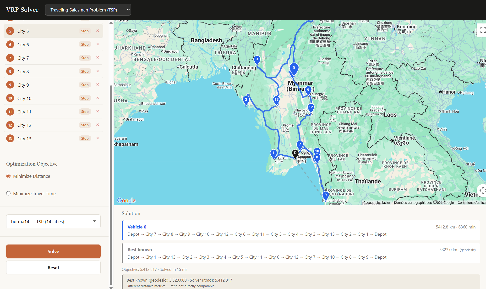
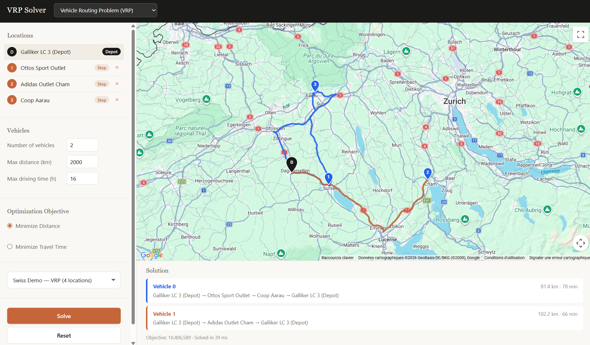

<p align="center">
  
</p>

<h1 align="center">VRP Solver</h1>

<p align="center">
  An interactive web application for solving Vehicle Routing Problems using Google OR-Tools.
  <br />
  Place locations on a map, configure vehicles and constraints, and visualize optimized routes.
  <br /><br />
  <a href="https://schiggy-3000.github.io/vehicle_routing_problem/"><strong>Live Demo</strong></a>
</p>

---

## Screenshots

| TSP &mdash; burma14 (14 cities) | VRP &mdash; Swiss Demo (4 locations) |
|:---:|:---:|
|  |  |

## Features

- **Multiple problem types** &mdash; TSP, VRP, Capacitated VRP (CVRP), VRP with Pickups & Deliveries (PDP), VRP with Time Windows (VRPTW)
- **Interactive map** &mdash; click to place locations, drag to explore; real road routes rendered via Google Directions API
- **Configurable constraints** &mdash; vehicle capacity, max distance, max driving time, time windows, pickup/delivery pairs
- **Benchmark instances** &mdash; load TSPLIB instances (e.g. burma14) with best-known route overlays computed using the TSPLIB GEO formula
- **Cross-highlighting** &mdash; hover a route in the solution panel or on the map to highlight it in both views

## Architecture

```
frontend/          Static HTML/CSS/JS served via GitHub Pages
  ├── index.html
  ├── css/style.css
  └── js/
      ├── main.js              App entry point, state management
      ├── map.js               Google Maps wrapper (markers, routes, overlays)
      ├── api.js               Backend API client
      ├── forms/               Sidebar forms (locations, vehicles, constraints)
      └── results/             Solution table and route renderer

backend/           FastAPI service deployed on Google Cloud Run
  ├── Dockerfile
  ├── app/
  │   ├── main.py              FastAPI app with CORS config
  │   ├── routers/             /solve and /distance endpoints
  │   ├── services/            Distance matrix (Google Distance Matrix API) and solver orchestration
  │   ├── solvers/             OR-Tools solver implementations per problem type
  │   └── models/              Pydantic request/response schemas

tests/             Pytest + Playwright test suite
  ├── backend/                 Unit tests, constraint validator, benchmark tests
  └── frontend/                E2E tests (instance loading, solve flow, reset)

sample_datasets/   Pre-built instances (TSPLIB, demo scenarios)
```

## Tech Stack

| Layer | Technology |
|-------|-----------|
| Frontend | Vanilla JS, Google Maps JS API |
| Backend | Python 3.12, FastAPI, Google OR-Tools |
| Distance Matrix | Google Distance Matrix API |
| Deployment | GitHub Pages (frontend), Google Cloud Run (backend) |
| Testing | Pytest, Playwright |

## Getting Started

### Prerequisites

- Python 3.12+
- A [Google Maps API key](https://developers.google.com/maps/documentation/javascript/get-api-key) with Distance Matrix, Directions, and Maps JS APIs enabled

### Backend (local)

```bash
cd backend
pip install -r requirements.txt
GOOGLE_MAPS_API_KEY=<your-key> uvicorn app.main:app --reload --port 8080
```

### Frontend (local)

1. Set your API keys in `frontend/js/config.js`
2. Serve the `frontend/` directory with any static file server:
   ```bash
   # Using VS Code Live Server, Python, or npx:
   npx serve frontend
   ```
3. Open the app in your browser and start placing locations on the map

### Running Tests

```bash
# Backend unit + benchmark tests
pytest tests/backend/

# Frontend E2E tests (requires the app to be running)
pytest tests/frontend/
```

## License

This project is provided for educational purposes.
